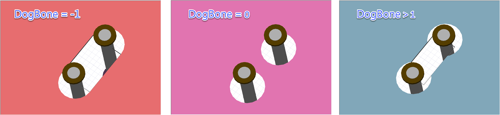

[English](README.md) | [繁體中文](README.zh-TW.md)

# Via Wizard

Via Wizard is a powerful, GUI-based tool designed to streamline the creation and simulation of PCB vias. It leverages **Ansys AEDT** (via `pyedb`) to generate high-fidelity simulation models directly from a user-friendly interface.

[](https://www.youtube.com/watch?v=z5gnXKUB2Dc)

## Features

### 1. Stackup Management
*   **Visual Editor**: View and edit layer properties (Thickness, Dk, Df, Conductivity).
*   **Import/Export**: Load and save stackups using XML format.
*   **Excel Integration**: Paste stackup data directly from Excel into the application.
*   **2D Visualization**: Real-time visual representation of the layer stackup.
*   **DogBone Void Customization**: Customize the void shape for differential pairs on reference layers.
    *   **-1**: Default antipad size.
    *   **0**: No void created.
    *   **>0**: Rectangular void with specified width.

    

### 2. Padstack Design
*   **Customizable Geometries**: Define hole diameter, pad size, and antipad size.
*   **Material Selection**: Choose from standard materials like Copper, Gold, or Aluminum.
*   **Backdrill Settings**: (Work in Progress) Configure backdrill parameters for signal integrity optimization.

### 3. Interactive Placement
*   **Canvas Editor**: Interactively place vias on a virtual PCB canvas.
*   **Placement Modes**:
    *   **Single Via**: Place individual signal vias.
    *   **Differential Pair**: Place differential pairs with configurable pitch and orientation.
    *   **GND Via**: Place grounding vias.
*   **Grid System**: Snap-to-grid functionality for precise alignment.

### 4. Simulation Export
*   **AEDB Generation**: Export your entire design (stackup, padstacks, placed instances) to an Ansys AEDB project (`.aedb`).
*   **Version Control**: Specify the target AEDB version (default: 2024.1).
*   **Automated Modeling**: The tool automatically handles the creation of materials, layers, padstacks, and vias in the AEDB file.

## Prerequisites

*   **Python**: Version 3.10 or higher.
*   **Ansys AEDT**: Installed and licensed (Version 2024.1 or newer recommended).
*   **Dependencies**:
    *   `pywebview`: For the GUI window.
    *   `pyedb`: For interacting with Ansys EDB.

## Installation

1.  **Run the installation script**:
    Double-click `install.bat` or run it from the command line:
    ```bash
    install.bat
    ```
    This script will set up the virtual environment and install all necessary dependencies.

## Usage

1.  **Start the Application**:
    Run the `main.py` script to launch the GUI.
    ```bash
    python main.py
    ```

2.  **Workflow**:
    *   **Stackup Tab**: Define your board layers. You can load `stack.xml` as a starting point.
    *   **Padstack Tab**: Create padstack definitions referencing the layers from your stackup.
    *   **Placement Tab**: Select a padstack and place instances on the canvas.
    *   **Simulation Tab**: Enter the desired AEDB version and click **Export to AEDB**.

3.  **Output**:
    The tool will generate a `.json` file of your project and a corresponding `.aedb` folder in the same directory.

## Project Structure

*   `main.py`: Application entry point. Initializes the `pywebview` window.
*   `api.py`: Contains the `ViaWizardAPI` class, bridging the JavaScript frontend and Python backend.
*   `modeling.py`: Core logic for generating the Ansys EDB model from the project data.
*   `gui/`: Contains the frontend assets (`index.html`, `app.js`, `style.css`).
*   `stack.xml`: Default stackup configuration file.

## License

MIT License
